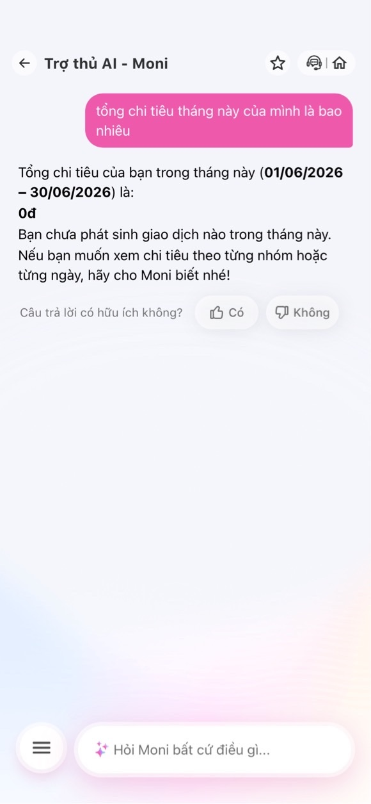
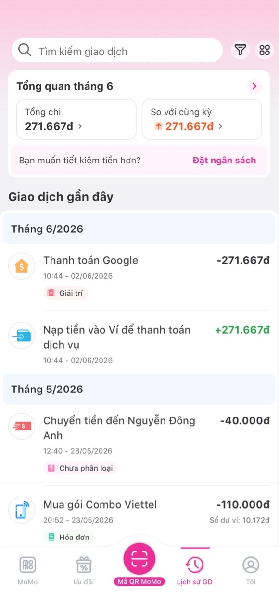

# Workshop — Mổ App AI Thật

**Thời gian:** 35-45 phút  
**Hình thức:** cá nhân trước, chia sẻ theo nhóm sau  
**Output:** finding note + sketch `as-is / to-be`

Mục tiêu không phải chấm "UI đẹp hay xấu". Mục tiêu là dùng sản phẩm thật như một bài needfinding: tìm chỗ product gãy trong workflow thật, rồi viết finding đó thành quyết định product.

## 1. Sản phẩm lựa chọn
* **Sản phẩm:** MoMo — Moni
* **AI Feature:** Trợ thủ tài chính, tự động phân loại và phân tích chi tiêu qua chatbot.
* **Cách truy cập:** Vào app MoMo -> Tìm kiếm "Moni".

---

## 2. Dùng thử: Promise vs Reality

* **Product hứa gì?** "Trở thành "trợ lý ảo của MoMo", giúp người dùng quản lý tài chính cá nhân toàn diện thông qua loạt tính năng: ghi nhận chi tiêu/thu nhập, lên kế hoạch ngân sách, tra cứu và báo cáo chi tiêu, thanh toán hóa đơn, chuyển tiền, gửi tiền, và nhiều chức năng liên quan đến quản lý tài chính khác."
* **User nào được hứa sẽ được giúp?** Người dùng hệ sinh thái MoMo cần một công cụ tập trung để theo dõi dòng tiền và tự động hóa các tác vụ tài chính hàng ngày.
* **Kỳ vọng của bạn:** AI có khả năng truy vấn chính xác và tức thời toàn bộ lịch sử giao dịch phát sinh trong tháng để báo cáo số liệu tổng quan khi được hỏi.
* **Điểm gãy thực tế:** Khi user hỏi tổng chi tiêu của tháng hiện tại, Moni báo cáo kết quả là **0đ** và khẳng định không có giao dịch nào phát sinh. Trong khi đó, hệ thống quản lý chi tiêu thực tế của MoMo đã ghi nhận giao dịch "Thanh toán Google" trị giá **271.667đ** từ ngày hôm trước. AI bị mất đồng bộ data hoặc không gọi đúng API để quét giao dịch mới nhất.

> **Evidence:**
> * **Prompt/Input đã thử:** *"tổng chi tiêu tháng này của mình là bao nhiêu"*
> * **Hành vi quan sát được:** Chatbot Moni khẳng định tổng chi tiêu Tháng 6/2026 là **0đ**. Tuy nhiên, màn hình Lịch sử giao dịch thực tế hiển thị rõ ràng một khoản trừ 271.667đ (Thanh toán Google) vào lúc 10:44 ngày 02/06/2026.
> * **Hình ảnh minh chứng:**
>
> 
> 

---

## 3. Vẽ 4 paths

| Path | Trải nghiệm thực tế trên MoMo Moni |
|---|---|
| **Happy** | **ĐÚNG VÀ TỰ TIN:** Khi user hỏi về các giao dịch tiêu chuẩn (Ví dụ: *"tháng trước tôi đã nạp tiền điện thoại hết bao nhiêu?"*) -> AI tự tin truy vấn chính xác lịch sử tháng 05/2026 là **40.000đ với 1 giao dịch** một cách mượt mà. |
| **Low-confidence** | **PRODUCT CHƯA CÓ:** Khi user dùng từ khóa mơ hồ (Ví dụ: *"đồ cúng"*, *"tình nghĩa"*), hệ thống không phân vân hay đưa ra các options gợi ý nhóm liên quan (như Mua sắm, Hiếu hỉ) để làm rõ intent, mà lập tức trả lời cứng nhắc là *"không có giao dịch"* dựa trên text matching thô. |
| **Failure** | **BÁO SAI DỮ LIỆU & UX KẸT:** Khi AI trả về kết quả sai lệch nghiêm trọng (Báo tổng chi tiêu tháng này là 0đ dù thực tế hôm trước đã tiêu 271.667đ cho Google) -> User không có nút nào để "Báo lỗi dữ liệu" hay "Force Sync" ngay tại màn hình chat mà bị kẹt hoàn toàn, phải tự thoát ra đối chiếu thủ công. |
| **Correction** | **MẤT BIẾN KHÔNG LƯU:** Dù user có vào bộ công cụ Quản lý chi tiêu để chỉnh sửa thủ công lại tag danh mục của giao dịch, hệ thống Chatbot Moni cũng không ghi nhận phiên log đó để tự học hỏi (No active learning) nhằm tối ưu kết quả cho các câu hỏi tương tự sau này. |

---

## 4. Viết Finding thành quyết định Product

* **Khi user:** Hỏi tổng chi tiêu của tháng hiện tại nhằm quản lý dòng tiền,
* **AI/product:** Trả về kết quả 0đ và khẳng định không có giao dịch dù lịch sử thực tế đã ghi nhận khoản chi 271.667đ,
* **Hậu quả là:** User nhận sai báo cáo tài chính, gây ức chế và làm mất hoàn toàn niềm tin vào độ chính xác của một trợ lý tiền bạc,
* **Lỗi thuộc layer:** Data-tool (API Fetching & Sync Layer).
* **Nên sửa bằng:** *Requirement & UX Recovery:* Cấu hình Chatbot buộc phải gọi API đồng bộ dữ liệu thời gian thực (độ trễ < 15 phút). Nếu hệ thống trả về kết quả bằng 0đ, bắt buộc phải hiển thị kèm một button fallback: "Kiểm tra Lịch sử giao dịch gốc" để user chủ động phòng ngừa lỗi data.

---

## 5. Sketch As-is / To-be

```text
                   [ CỘT AS-IS ]                                                 [ CỘT TO-BE ]
               
        Hỏi Tổng chi tiêu tháng 6/2026                                 Hỏi Tổng chi tiêu tháng 6/2026
                         │                                                              │
                         ▼                                                              ▼
               AI gọi API quét data                                           AI gọi API quét data
                         │                                                              │
           [X] LỖI DATA-TOOL: Mất đồng bộ,                                 [!] CƠ CHẾ BACKUP REAL-TIME:
               DB trả về kết quả = 0đ                                         Ép Force Sync data trong 48h
                         │                                                              │
                         ▼                                                              ▼
            Moni tự tin phán: "0đ. Bạn                                        Moni trả lời số liệu đã sync.
            chưa phát sinh giao dịch nào"                                     Nếu DB vẫn = 0đ -> Kích hoạt fallback:
                         │                                                    "Dữ liệu đang cập nhật, bấm vào đây
                         ▼                                                    để xem Lịch sử gốc" (UX Recovery)
         [KẸT] User phải tự thoát Chatbot,                                              │
         mò vào tab Lịch sử để đối chiếu thủ công.                                      ▼
                                                                             User xem được data gốc ngay tại chat.
```

## 6. Tự kiểm trước khi nộp

- [x] Có ít nhất 1 screenshot hoặc observation cụ thể.
- [x] Có đủ 4 paths hoặc nói rõ path nào chưa có trong product.
- [x] Finding được viết thành product decision, không chỉ là nhận xét.
- [x] Sketch có as-is và to-be.
- [x] Có một câu nói rõ finding này sẽ đổi gì trong SPEC.